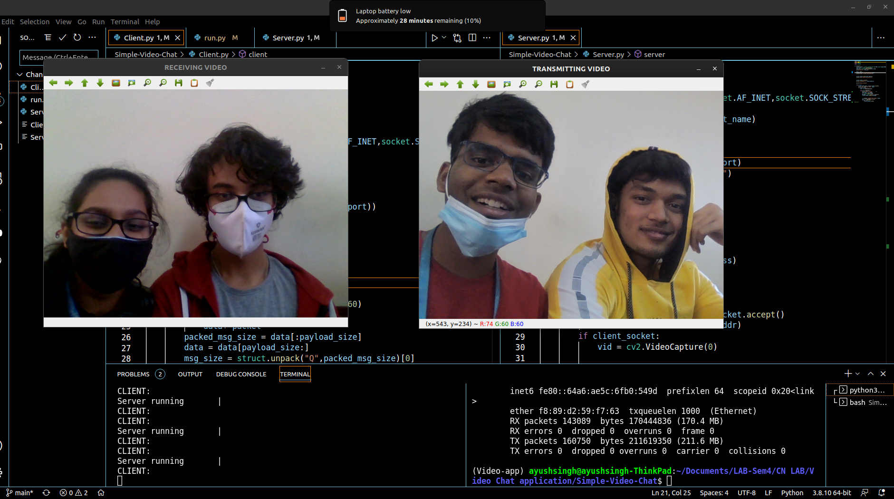
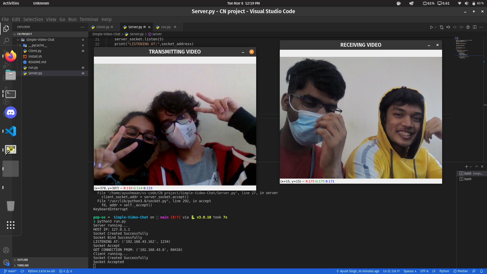

# **Computer Networks - UE20CS253**

## Assignment - Socket programming

---

    Ayush Singh         - PES2UG20CS081
    Bhavini Madhuranath - PES2UG20CS088
    Ayushmaan Kaushik   - PES2UG20CS082

---

## **Project title - Simple video chat application using socket programming**

---

## Abstract

The application aims to create a peer-to-peer connection and relay video feed between the two peers.
This is achieved by establishing two socket connections, by the use of `client` and `server` programs running simultaneously, which is achieved by multithreading. The `server` program transmits the video feed of a user while the `client` program receives the incoming data.  
The connection created follows TCP, as the socket is created with the parameter `SOCK_STREAM`

---

### Server side

1. the socket is created and bound with the hostname and the IP address of the system using

```py
socket.gethostname()	# provides hostname
socket.gethostbyname(hostname)	# provides IP address
socket.bind()
```

2. the socket begins listening at the designated port (given as 1235)
3. the socket accepts the connection using

```py
socket.accept()
```

4. the video feed is captured using OpenCV

```py
cv2.VideoCapture()
```

5. the captured video is serialised, packed into frames and sent to the client socket

```py
pickle.dumps(frame)	# serialisation of object
struct.pack("Q",len)	# packing of data in segments of size long long int
socket.sendall()	# transmission of packets
```

6. the server continues to send video packets until the connection is closed

---

### Client side

1. the socket is created and the connection is established
2. the data variable is created and the payload size is calculated

```py
socket.connect(host_ip,port)
struct.calcsize("Q") 	# payload size equal to long long int
```

3. the socket begins accepting packets and the data variable begins slicing the data based on the payload size

```py
socket.recv()	# receiving packets from server
struct.unpack() # unpacking received data
```

4. the frames are loaded and displayed until the connection is closed

```py
pickle.loads()	# loading data onto frames
cv2.imshow()	# display of frames
```

---

## Source code

Github repository:https://github.com/MadKauSing/Simple-Video-Chat.git
### Server.py

```py
# server side program
# libraries
import socket  # library to manage socket
import cv2  # library to capture video
import pickle  # library to implement 'pickling' ie serialisation of a python object
import struct  # library to pack and unpack data


def server():
    server_socket = socket.socket(socket.AF_INET, socket.SOCK_STREAM)
    host_name = socket.gethostname()
    host_ip = socket.gethostbyname(host_name)
    print("HOST IP:", host_ip)

    port = 1235
    socket_address = ("192.168.43.6", port)
    print("Socket Created Successfully")

    server_socket.bind(socket_address)
    print("Socket Bind Successfully")

    server_socket.listen(5)
    print("LISTENING AT:", socket_address)

    print("Socket Accept")

    while True:
        client_socket, addr = server_socket.accept()
        print("GOT CONNECTION FROM:", addr)
        if client_socket:
            vid = cv2.VideoCapture(0)

            while vid.isOpened():
                print("Server running       |")
                img, frame = vid.read()
                a = pickle.dumps(frame)
                message = struct.pack("Q", len(a)) + a
                client_socket.sendall(message)

                cv2.imshow("TRANSMITTING VIDEO", frame)
                key = cv2.waitKey(1) & 0xFF
                if key == ord("q"):
                    client_socket.close()


# server()
```

### Client.py

```py
# client side program
# libraries
import socket  # library to manage socket
import cv2  # library to capture video
import pickle  # library to implement 'pickling' ie serialisation of a python object
import struct  # library to pack and unpack data


def client():
    # creation of socket
    client_socket = socket.socket(socket.AF_INET, socket.SOCK_STREAM)
    host_ip_server = "192.168.43.162"
    port = 1234
    print("Socket Created Successfully")

    # establishment of connection
    client_socket.connect((host_ip_server, port))
    data = b""
    payload_size = struct.calcsize("Q")
    print("Socket Accepted")

    # data transmission loop
    while True:
        print("CLIENT:")
        # loop to receive new packet
        while len(data) < payload_size:
            packet = client_socket.recv(2160)
            if not packet:
                break  # error condition
            data += packet
        # slice packet based on payload size and store separately
        packed_msg_size = data[:payload_size]
        data = data[payload_size:]
        # unpack the received data
        msg_size = struct.unpack("Q", packed_msg_size)[0]

        # loop to receive more data
        while len(data) < msg_size:
            data += client_socket.recv(2160)
        # dividing data into frames
        frame_data = data[:msg_size]
        data = data[msg_size:]
        # loading and display of frames
        frame = pickle.loads(frame_data)
        cv2.imshow("RECEIVING VIDEO", frame)
        key = cv2.waitKey(1) & 0xFF
        if key == ord("q"):
            break
    # closing of connection
    client_socket.close()


# client()


```

---

## Output screenshots

### Peer 1



### Peer 2


---
---